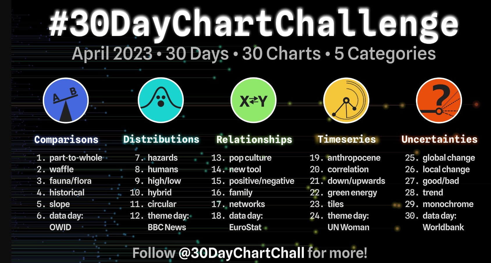
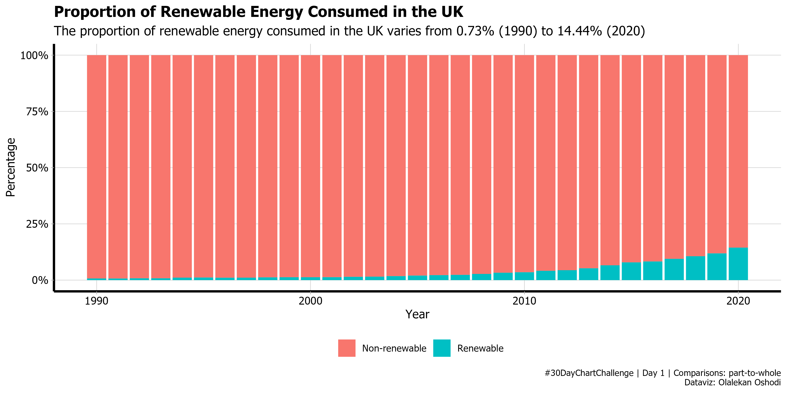
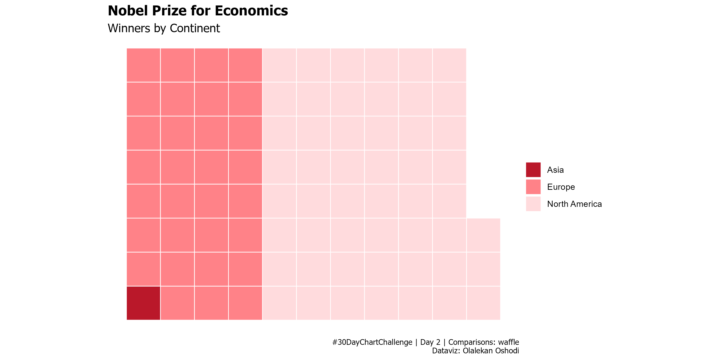
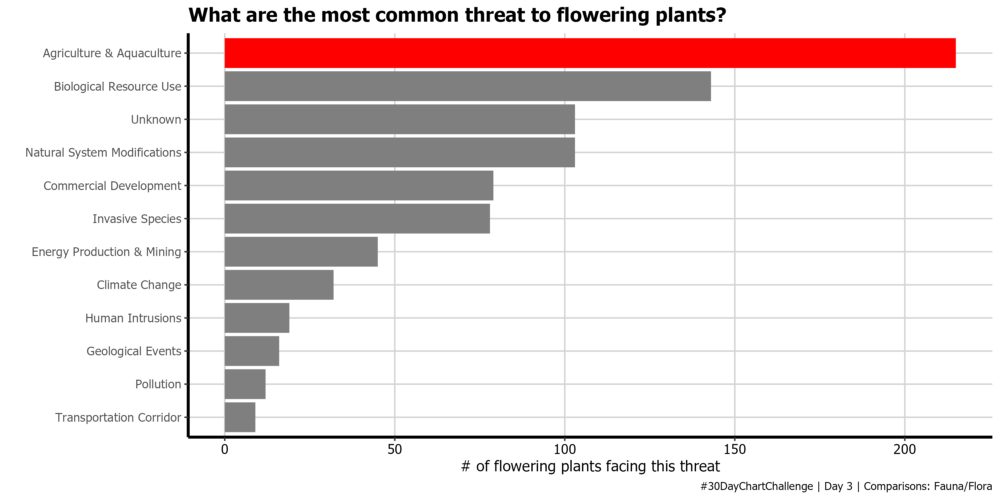
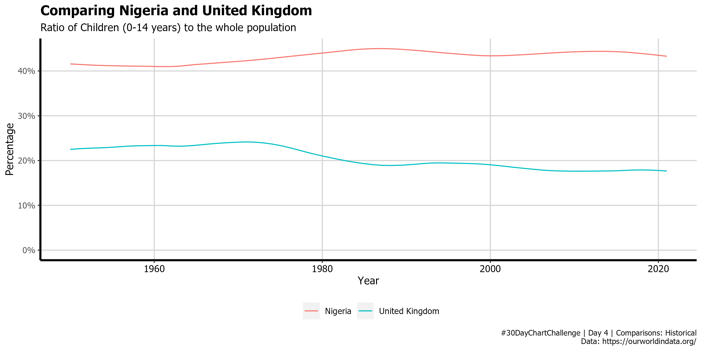
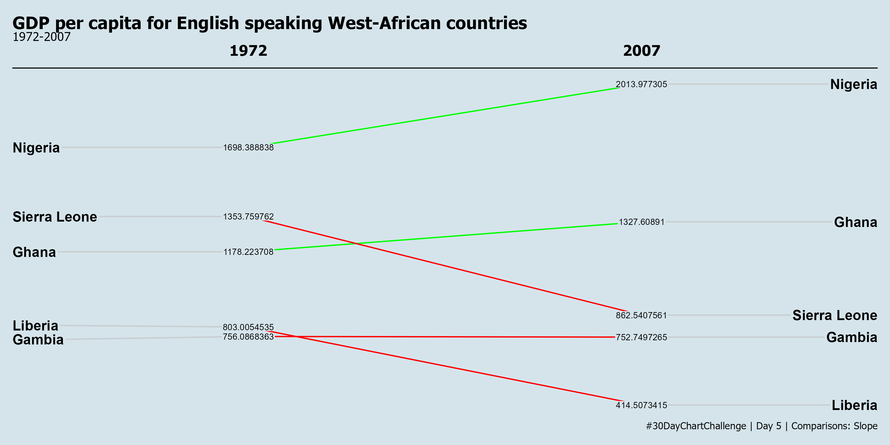
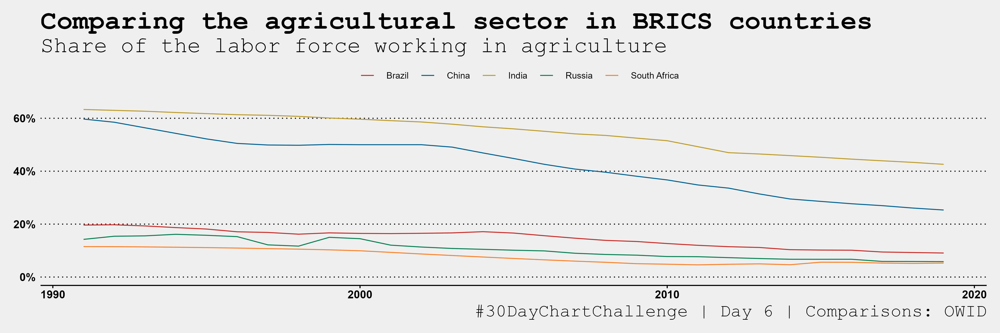
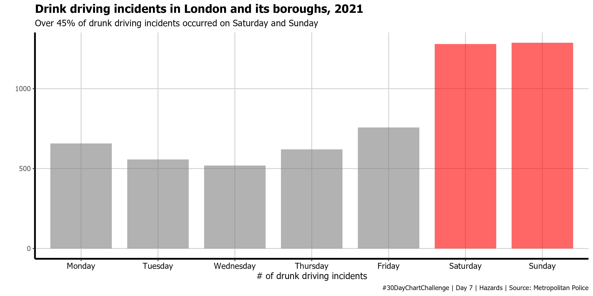
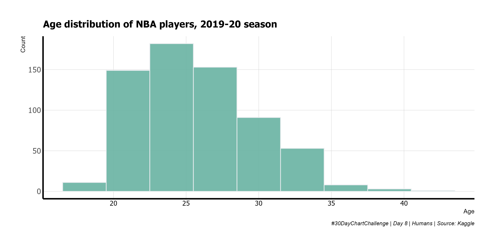
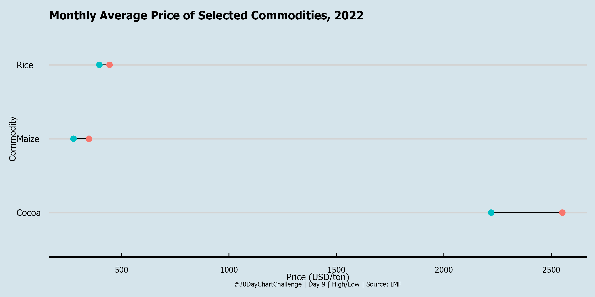

\#30DayChartChallenge contributions - April 2023
================

Welcome to my 2023 \#30DayChartChallenge repo. You can view for R code
used to create each figure by clicking on it. if you like what you see,
[get in touch](https://twitter.com/Oshodi_OS)!

## Visualizations

### Day 1 - Part to whole - 🛠️ RStats

### Day 2 - Waffle - 🛠️ RStats

### Day 3 - Fauna/Flora - 🛠️ RStats

### Day 4 - Historical - 🛠️ RStats

### Day 5 - Slope - 🛠️ RStats

### Day 6 - OWID - 🛠️ RStats

### Day 7 - Hazards - 🛠️ RStats

### Day 8 - Humans - 🛠️ RStats

### Day 9 - High/Low - 🛠️ RStats

